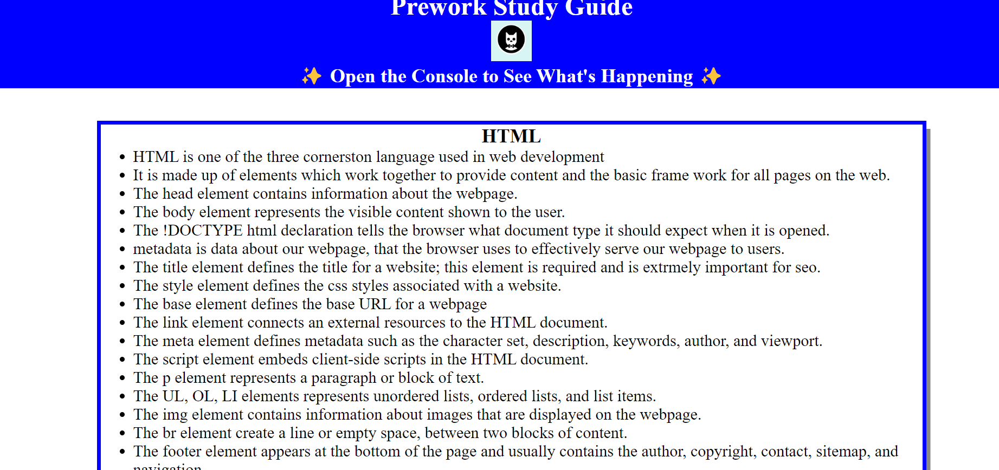

# prework-study-guide

## Description
A study guide for course pre-work. this website makes it easier to preview 
and study up on topics learned in bootcamp. topics like: HTML,css,
javascript, git.

## App link
https://tegaomare.github.io/prework-study-guide/
 

## Usage
each section contains notes about a topic on HTML, CSS, JavaScript, Git. And if you open the DevTools console, you can see the JavaScript running. It will list the topics we learned from prework and choose one topic for us to study first. 

## Credits
Columbia University Coding Bootcamp 

## License
MIT license
